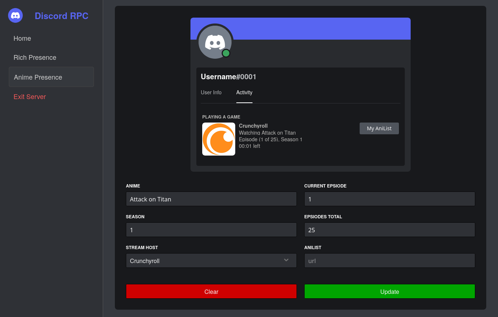
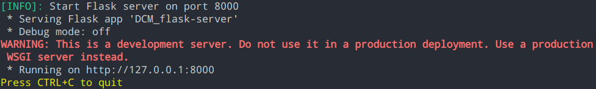

# Anime Discord RPC

This project, enables a rich presence display in Discord when watching anime. With the help of a Firefox addon, you get additional possibilities, such as an automatic display of the Rich Presence.

## How it works

### Server

The project consists of two main parts. The first, and most important, is the Python program (`DCM_flask-server.py`), which provides a small local server using [Flask](https://flask.palletsprojects.com/en/2.3.x/) at the address `localhost:8000`. Various options are available via this server.  

If the server could be started, the address should be accessible in the browser and the start page with the documentation should appear. There are also other pages available. Among others, `localhost:8000/rpc`, which is a feature not yet implemented, but above all the route `http://localhost:8000/rpc_anime`.  

Under this route, various options are now available to set and start your individual display for anime, as well as to stop it.  
While you are making settings or changing values, you will be shown how it will look on Discord.



The **Update** button starts the display with the entered values. The **Clear** button ends the display, but the entered values remain. For both buttons, a short message appears if everything has worked. If there is none, something has gone wrong.

The server can be terminated via 'Exit Server'. This will end all displays that are currently running.

### Firedox Add-On

With the optional [Add-On](https://addons.mozilla.org/en-US/firefox/addon/anime-discord-rpc1/?utm_source=addons.mozilla.org&utm_medium=referral&utm_content=search), which is currently only available for Firefox, the display can be simplified and even more options are available.  

If the add-on has been successfully installed, the same options are available via the pop-up menu as via the server pages. However, you have to make sure that **the server is still running, as it is currently not possible to start the display directly from the browser, so a background server is always necessary for communication with the Discord gateway!** !


The following options are available via the buttons at the bottom (from left to right):

1. Clear/Stop the display.
2. Synchronise the values with the last stream. That means, if available, the values from the last video you watched on the [supported websites](#currently-supported-websitesstream-hosts) are automatically entered into the fields.
3. Start the display. Starts a rich presence with the currently entered values. (As far as [possible](#notes-for-starting-a-display-rich-presence))

**Possible error displays:**

Error | Meaning
--- | ---
**REQUESTING SERVER FAILED!** | The server could not be reached. This is usually because the server is not running. If you start the server via `DCM_flask-server` it should work.
**INTERNAL SERVER ERROR!** | This error means that the server can be reached, but an error has occurred internally. This can be due to the fact that the entered values are not correct or Discord is not accessible.
**NO DATA AVAILABLE!** | This can occur if you have not watched any anime (on the [supported sites](#currently-supported-websitesstream-hosts)) or if the last values of the stream are no longer available due to a restart.

Various actions can be performed in the settings of the pop-up menu.  


The user name and the tag can be entered in the **layout section**. However, this is only relevant for the design of the local display of the add-on and has no effect on the display on Discord.  

The possibility of **Auto-RPC** means that a display is automatically started when you watch anime on one of the [supported sites](#currently-supported-websitesstream-hosts), or is automatically stopped when you stop watching. Logically, the values of the current stream are used and not those entered.  
This can be activated or deactivated via the option 'Enable Auto RPC'.  
With the option `Use streamhost from watching` you can determine whether the stream host on which you are currently watching should be used for the automatic display. If this option is deactivated, the stream host set in the pop-up is used.  

In the **Server** section, the current status of the server can be viewed. With `Server is running!` all is well, the server can be contacted successfully. With `Server can't be accessed!` a problem has occurred with the connection to the server. In this case you should check whether the server is running or whether the address is already being used by another programme. With `Check Status` the connection can be tested again. With `Shutdown Server` the server can be shut down, but this only has an effect in the case of *Server is running!*.

### Notes for starting a display (Rich Presence)

When starting a display/Rich Presence (RPC), some values are mandatory and will lead to an error if they are not specified.  

Values that must always be specified:  
`Anime`

Values of which at least one must be specified:  
`Current episode`  
`Season`

All other values are optional. Here is an overview of all values:

Value | Description | Required
--- | --- | ---
`Anime` | Stands for the title of the anime (for example Attack on Titan) | yes
`Current episode` | Indicates the episode currently being watched | yes, if season not specified 
`Episodes total` | Indicates the number of episodes in the current season | no
`Season` | Indicates the current season being watched. | yes, if Current episode is not specified
`Stream host` | Select the stream host you are using to watch. If your host is not listed, feel free to suggest it for the next update. | Yes
`Anilist` | If you have an account with a provider like [AniList](https://anilist.co/) or [MyAnimeList](https://myanimelist.net/), you can enter a link which can then be opened by others in Discord via a button. However, please observe Discord's [guidelines](https://support.discord.com/hc/en-us/sections/115000344951-Privacy-and-Policy) when providing a link. | no

### Currently supported websites/stream hosts

- [www.crunchyroll.com](https://www.crunchyroll.com/)
- [aniworld.to](https://aniworld.to/) (:warning: Use at own risk!)

## Installation

### Standard installation

To install the latest version you can find several files on GitHub [Releases](https://github.com/Revox179/Anime-Discord-RPC/releases). If you use Windows you need the `DCM-flask_server.exe` and under Linux `DCM-flask_server`.  
After downloading the file, under Linux you still need to mark the file as executable and otherwise just run it normally. To check whether the file has started, simply call `localhost:8000` in the browser. If the website is accessible, everything has worked. Alternatively, the file can also be started from the terminal to get an output that allows for better troubleshooting.  

The add-on can be installed from [here](https://addons.mozilla.org/en-US/firefox/addon/anime-discord-rpc1/?utm_source=addons.mozilla.org&utm_medium=referral&utm_content=search) in Firefox.


### Installing from source code

To use the project from the source code, the repository must first be downloaded from GitHub. To start the server, you also need Python on your computer. If these requirements are met, the following Python packages must be installed via pip:

```
pip install requests
pip install pypresence
pip install Flask
pip install Flask-Cors
pip install pyinstaller
```

Now the file `DCM-flask_server.py` can be executed with Python. If everything runs properly, you should have received the following output, indicating that the server has been started successfully:



The Firefox addon can also be installed from the source code, but then it has the limitation that it is not permanently installed, but is automatically uninstalled every time the browser is closed.  
To install it in Firefox, you must first open the [debug page](about:debugging#/runtime/this-firefox) for Firefox addons. Here you now have the option `Load Temporary Add-on`, via which you select and load the file `manifest.json` in the `extension` folder of the repository. Now the add-on should be successfully loaded for the current session.